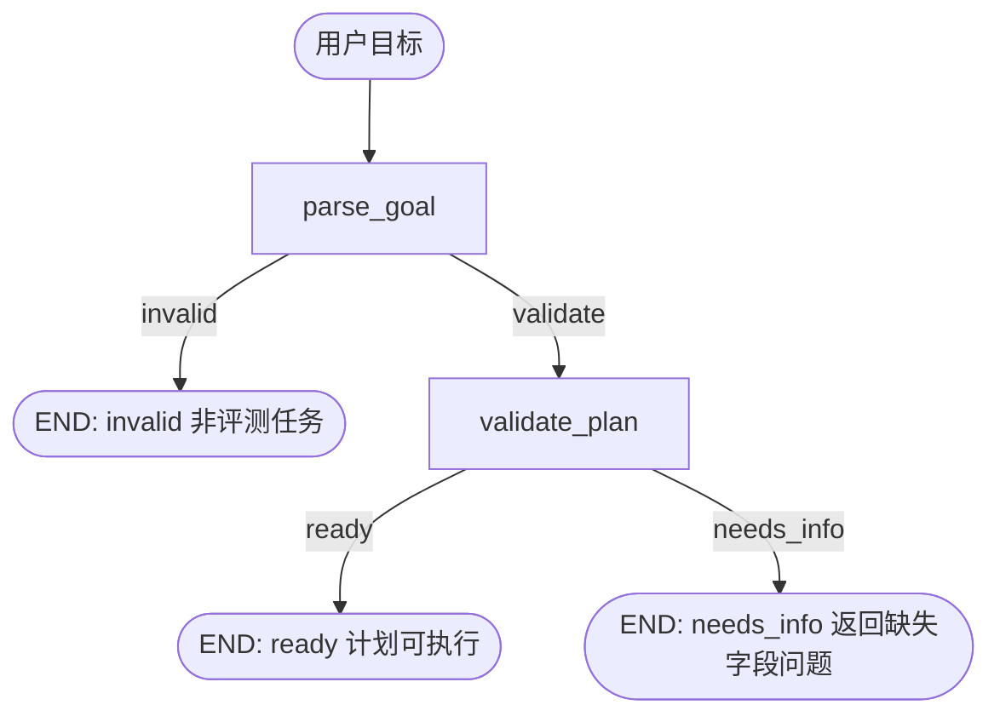

# EvalAgent

EvalAgent 是一个用 **LangGraph StateGraph** 编排的"评测 Agent"：把一句自然语言评测目标（如"用 mock 评测 dataset.jsonl 并对比两个模型"）解析成结构化评测计划，再调用 **EvalHub**（执行评测）与 **RAGEval**（RAG 检索）两个服务完成端到端评测，并对执行过程提供检查点恢复、安全审批与幂等防重（40 天学习路线 Day 34 起）。

## 架构

核心是 LangGraph 状态图（`evalagent/goal_graph.py`，Day 35）：



执行期分层（Day 36–39）：

```text
自然语言目标
  → goal_graph（parse_goal → validate_plan，产出 EvaluationPlan）
  → ToolRegistry（先 Pydantic 校验、再调 EvalHub 评测 / RAGEval 检索）
  → SafetyGate（allow / awaiting_approval / block）
  → Checkpoint + Resume（断点续跑、幂等防重、结果验证）
  → 端到端报告（artifacts/e2e_report.md）
```

| 模块 | 职责（对应 Day） |
|---|---|
| `evalagent/models.py` | `EvaluationPlan` 结构化计划：models / dataset / evaluators / sample_limit / steps（Day 35） |
| `evalagent/goal_graph.py` | 自然语言目标 → 计划的最小 StateGraph（规则解析，不调 LLM）（Day 35） |
| `evalagent/tools.py` | `ToolRegistry` 服务工具：名字 + 说明 + Pydantic 输入模型，非法参数不调服务，HTTP 5xx 映射为 retryable（Day 36） |
| `evalagent/safety.py` | 安全策略：allow（只读/低风险自动执行）、awaiting_approval（超预算/超并发/样本过多暂停等确认）、block（危险请求拦截）（Day 38） |
| `evalagent/checkpoint.py` | `CheckpointStore`：把 run 状态持久化为 JSON（不存明文密钥）（Day 37） |
| `evalagent/resume.py` | `ResumableRunner`：幂等创建 job、断点续跑、结果验证（Day 37） |
| `evalagent/e2e.py` | 端到端：`request_id` 贯穿、有界重试（MAX_RETRIES=2）（Day 39） |
| `api/main.py` | FastAPI 最小服务：`/health` |

详细设计文档：`docs/state_graph.md`、`docs/tool_contracts.md`、`docs/security_policy.md`、`docs/recovery_scenarios.md`。

## 功能

- **自然语言目标 → 结构化计划**：识别评测意图、模型名（KNOWN_MODELS）、数据集路径、样本数上限；缺参数返回 `needs_info` + 缺失字段问题，不执行（Day 35）
- **非法目标拦截**：无模型名且无评测意图关键词 → `invalid`（Day 35）
- **带校验的服务工具**：每个工具先用 Pydantic 校验输入，非法参数不调用服务；服务端 5xx 标记可重试（Day 36）
- **检查点与幂等恢复**：重启后不重建已创建的 job（防重复收费）、重复 resume 幂等、92/100 样本不完整时标 `incomplete` 绝不误报完成（Day 37）
- **安全审批**：危险请求（删除数据/任意 Shell/未授权路径）直接 block；超预算、超并发、样本过多的写操作暂停等待人工确认（Day 38）
- **端到端评测**：三服务 docker compose 编排，`X-Request-Id` 贯穿 evalagent→evalhub→rageval，失败有界重试，产出 Markdown 报告（Day 39）

## Quick Start

Python 3.11 + LangGraph（`langgraph>=1.0`）。从空目录开始：

```powershell
git clone https://github.com/xl819436-creator/EvalAgent.git
cd EvalAgent
conda create -n evalagent-py311 python=3.11 -y
conda activate evalagent-py311
python -m pip install -r requirements.txt
python -m pip check
python -m pytest -q
```

端到端演示（三服务 compose，需 `../EvalHub-course` 与 `../RAGEval` 可构建，见 `compose.yaml`）：

```powershell
docker compose up --build -d
docker exec evalagent python scripts/e2e_demo.py
# 报告输出到 artifacts/e2e_report.md
```

## 测试

```powershell
python -m pytest -q
```

本机实测（2026-08-29，Python 3.11.15）：**27 passed**，覆盖：

- 目标解析与计划校验（ready / needs_info / invalid 三分支）
- 工具注册与输入校验（非法参数不调服务）
- 恢复场景 4 例：重启不重建 job、92/100 标 incomplete、重复 resume 幂等、checkpoint 不存密钥（`tests/test_resume_idempotency.py`）
- 安全策略三态与危险请求拦截（`tests/`，`scripts/evaluate_safety_cases.py`）
- 端到端 request_id 贯穿与有界重试（`tests/test_e2e.py`）

## 实验结果

- **端到端演示（Day 39，`artifacts/e2e_report.md`）**：三服务全部 healthy；比较两个模型 + RAG 解释的评测报告状态 `completed`、退出码 0
- **故障隔离实测（Day 39，`notes/day39.md`）**：停掉 rageval → 报告 `incomplete`、退出码 1（不把不完整结果当成功）；停掉 evalhub → 只重试 2 次（MAX_RETRIES=2），不无限循环
- **恢复场景测试（Day 37，`docs/recovery_scenarios.md`）**：进程在创建外部 job 后崩溃 → 重启后 `create_job` 只调用 1 次（幂等，不重复收费）；`completed_steps=[0,1,2]` 全部续跑完成

## 失败案例

- **幂等失败的坑（Day 37 场景一）**：进程在 `create_job` 成功后、任何步骤执行前崩溃；若重启后盲目重建 job，外部评测任务会被创建两次 → **重复收费**。解法：CheckpointStore 先持久化 `external_job_id`，重启后用同一 `run_id` resume 时不再调用 `create_job`，沿原 job 续跑（实测 `create_calls` 保持 1）。
- **把不完整结果当成功的坑（Day 37 场景二 / Day 39 实测）**：外部任务实际只完成 92/100 条，或评测服务中途宕机——若按"步骤执行完"上报 completed 就是误报。解法：结果验证 `actual < expected → status=incomplete` 且退出码非 0。

## 已知限制

- **规则解析**：`parse_goal` 只认 KNOWN_MODELS 名单与固定意图关键词，不支持任意模型名和复杂自然语言（可复现优先，未接 LLM 解析）
- **工具直连**：服务调用为 HTTP 直连（httpx），只有有界重试，无分布式补偿事务
- **JSON 检查点**：MVP 用 JSON 文件持久化，非 SQLite/分布式存储
- **依赖本机目录**：三服务 compose 需 `../EvalHub-course` 与 `../RAGEval` 可构建；单独 clone EvalAgent 只能跑单服务测试与演示
- **评测以 mock/dummy 为主**：端到端演示使用 mock 模型，未接真实 LLM API 评测
